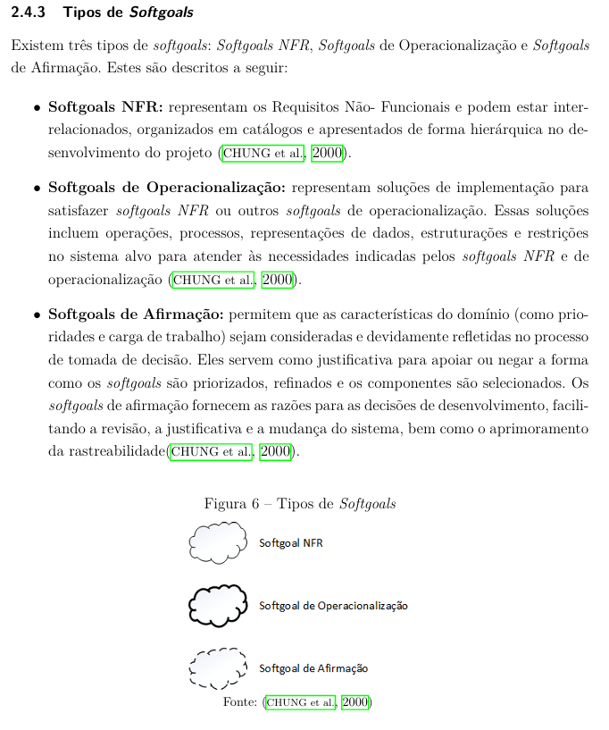
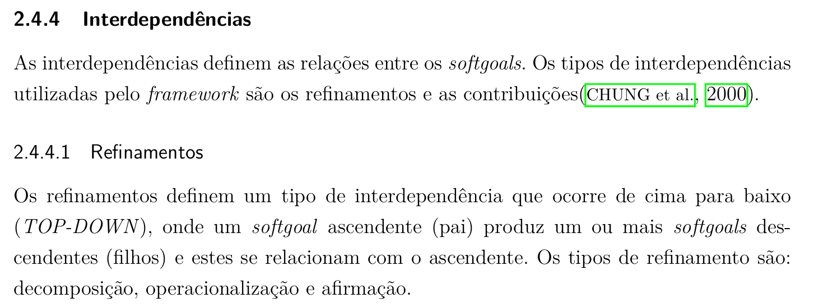

# Autoavaliação do Grupo 4

## Introdução

Conforme planejado, o Grupo 4 deve inspecionar os artefatos que produziu, visando a correção futura de artefatos que não atendem aos seus requisitos especificados.

## Objetivos

O objetivo deste documento é relatar os resultados da autoavaliação da 4ª etapa do projeto do [Grupo 4](https://requisitos-de-software.github.io/2024.2-MeuSUSDigital/), em forma de inspeção. Será verificado se os artefatos produzidos nesta segunda etapa cumprem com as condições e padrões exigidos. É importante citar que essa verificação não tem como intuito diminuir os membros responsáveis por cada artefato ou seu trabalho, apenas aplicar os conceitos de verificação.

## Inspeção

A inspeção foi baseada na [lista de verificação da 4ª entrega](../../lista_verif/entrega4.md) produzida com a ajuda do professor e dos integrantes do grupo.

**Tabela 1** ─ Resultado da Inspeção de Modelagem Ágil de Requisitos

<table border="1">
  <thead>
    <tr>
      <th>N°</th>
      <th>Questão</th>
      <th>Avaliação</th>
      <th>Autor</th>
      <th>Data e Hora</th>
    </tr>
  </thead>
  <tbody>
    <tr>
      <td colspan="5" style="text-align: center; font-weight: bold;">Itens do Desenvolvimento do Projeto</td>
    </tr>
    <tr>
      <td>1</td>
      <td>O histórico de versão padronizado?</td>
      <td></td>
      <td>André Barros</td>
      <td></td>
    </tr>
    <tr>
      <td>2</td>
      <td>O(s) autor(es) e o(s) revisor(es) para cada artefato?</td>
      <td></td>
      <td>André Barros</td>
      <td></td>
    </tr>
    <tr>
      <td>3</td>
      <td>Referências bibliográficas e/ou bibliografia em todos os artefatos?</td>
      <td></td>
      <td>André Barros</td>
      <td></td>
    </tr>
    <tr>
      <td>4</td>
      <td>As tabelas e imagens possuem legenda e fonte e elas chamadas dentro dos texto?</td>
      <td></td>
      <td>André Barros</td>
      <td></td>
    </tr>
    <tr>
      <td>5</td>
      <td>Um texto fazendo uma introdução dos artefatos?</td>
      <td></td>
      <td>André Barros</td>
      <td></td>
    </tr>
    <tr>
      <td>6</td>
      <td>O cronograma executado com quem realizou cada artefato/atividade com as datas de início e fim da construção realização do artefato/atividade?</td>
      <td></td>
      <td>André Barros</td>
      <td></td>
    </tr>
    <tr>
      <td>7</td>
      <td>Ata(s) da(s) reuniões (com data, horário de início e do final, participantes, objetivo, atividades definidas etc)?</td>
      <td></td>
      <td>André Barros</td>
      <td></td>
    </tr>
    <tr>
      <td>8</td>
      <td>A gravação da reunião do grupo?</td>
      <td></td>
      <td>André Barros</td>
      <td></td>
    </tr>
    <tr>
      <td>9</td>
      <td>Vídeo de apresentação na categoria “não listado” no youtube?</td>
      <td></td>
      <td>André Barros</td>
      <td></td>
    </tr>
  </tbody>
  <tbody>
    <tr>
      <td colspan="5" style="text-align: center; font-weight: bold;">Itens do conteúdo da disciplina</td>
    </tr>
    <tr>
      <td><a id="REF1" href="#anchor_1">1</a></td>
      <td>As Histórias de Usuário?</td>
      <td></td>
      <td>André Barros</td>
      <td></td>
    </tr>
    <tr>
      <td>2</td>
      <td>Os títulos das histórias de usuário são auto-explicativo?</td>
      <td></td>
      <td>André Barros</td>
      <td></td>
    </tr>
    <tr>
      <td>3</td>
      <td>O “quem”, “o que” e o “por que” estão definidos na história de usuário?</td>
      <td></td>
      <td>André Barros</td>
      <td></td>
    </tr>
    <tr>
      <td>4</td>
      <td>A participação do cliente e/ou persona na validação das histórias de usuário?</td>
      <td></td>
      <td>André Barros</td>
      <td></td>
    </tr>
    <tr>
      <td><a id="REF2" href="#anchor_2">5</a></td>
      <td>A história possui critérios de aceitação?</td>
      <td></td>
      <td>André Barros</td>
      <td></td>
    </tr>
    <tr>
      <td>6</td>
      <td>A participação do cliente e/ou persona na elicitação de requisitos?</td>
      <td></td>
      <td>André Barros</td>
      <td></td>
    </tr>
    <tr>
      <td>7</td>
      <td>Todas as histórias de usuários podem ser testadas?</td>
      <td></td>
      <td>André Barros</td>
      <td></td>
    </tr>
    <tr>
      <td><a id="REF3" href="#anchor_3">8</a></td>
      <td>O backlog?</td>
      <td></td>
      <td>André Barros</td>
      <td></td>
    </tr>
    <tr>
      <td>9</td>
      <td>O backlog possui épicos e temas bem definidos e descritos?</td>
      <td></td>
      <td>André Barros</td>
      <td></td>
    </tr>
    <tr>
      <td>10</td>
      <td>As Histórias de Usuário seguem algum modelo ou padrão?</td>
      <td></td>
      <td>André Barros</td>
      <td></td>
    </tr>
    <tr>
      <td><a id="REF5" href="#anchor_5">11</a></td>
      <td>NFR Framework?</td>
      <td></td>
      <td>André Barros</td>
      <td></td>
    </tr>
    <tr>
      <td>12</td>
      <td>A definição do RNF e as fontes de evidência na literatura?</td>
      <td></td>
      <td>André Barros</td>
      <td></td>
    </tr>
    <tr>
      <td>13</td>
      <td>O cartão de especificação do RNF?</td>
      <td></td>
      <td>André Barros</td>
      <td></td>
    </tr>
    <tr>
      <td><a id="REF7" href="#anchor_7">14</a></td>
      <td>Os softgoals condizem com o contexto?</td>
      <td></td>
      <td>André Barros</td>
      <td></td>
    </tr>
    <tr>
      <td>15</td>
      <td>Softgoals representam metas bem definidas?</td>
      <td></td>
      <td>André Barros</td>
      <td></td>
    </tr>
    <tr>
      <td>16</td>
      <td>Os impactos foram corretamente propagados?</td>
      <td></td>
      <td>André Barros</td>
      <td></td>
    </tr>
  </tbody>
  <tbody>
    <tr>
      <td colspan="5" style="text-align: center; font-weight: bold;">Itens Desenvolvidos Pelo Grupo</td>
    </tr>
    <tr>
      <td>Q1</td>
      <td>As histórias de usuário possuem rastreabilidade?</td>
      <td></td>
      <td>Artur Ricardo</td>
      <td></td>
    </tr>
    <tr>
      <td>Q2</td>
      <td>As histórias de usuário no backlog estão priorizadas de acordo com a importância para o negócio e o usuário?</td>
      <td></td>
      <td>Emivalto Júnior</td>
      <td></td>
    </tr>
    <tr>
      <td>Q3</td>
      <td>Os épicos derivam mais de uma <em>feature</em>?</td>
      <td></td>
      <td>João Pedro</td>
      <td></td>
    </tr>
    <tr>
      <td><a id="REF8" href="#anchor_8">Q4</a></td>
      <td>O NFR Framework possui os 3 tipos de <em>softgoals</em>?</td>
      <td></td>
      <td>Matheus Henrick</td>
      <td></td>
    </tr>
    <tr>
      <td><a id="REF9" href="#anchor_9">Q5</a></td>
      <td>Os refinamentos do NFR Framework estão descritos da forma correta?</td>
      <td></td>
      <td>Pedro Lopes</td>
      <td></td>
    </tr>
  </tbody>
</table>

  
Autores: <a href="https://github.com/pLopess">Pedro Lopes</a>, <a href="https://github.com/EmivaltoJrr">Emivalto Júnior</a>, <a href="https://github.com/JoosPerro">João Pedro</a>, <a href="https://github.com/algorithmorphic">Artur Ricardo</a>, <a href="https://github.com/MatheusHenrickSantos">Matheus Henrick</a> e André Barros.

## Gravação da Inspeção do Grupo 4

<incorporar>

  
Autores: <a href="https://github.com/pLopess">Pedro Lopes</a>, <a href="https://github.com/EmivaltoJrr">Emivalto Júnior</a>, <a href="https://github.com/JoosPerro">João Pedro</a>, <a href="https://github.com/algorithmorphic">Artur Ricardo</a>, <a href="https://github.com/MatheusHenrickSantos">Matheus Henrick</a>

## 📚 Referências Bibliográficas

> VAZQUEZ, Carlos Eduardo; SIMÕES, Guilherme Siqueira. Engenharia de Requisitos: software orientado ao negócio. Rio de Janeiro: Brasport, 2016.
>
> - <a id="anchor_1" href="#REF1">[1]</a> 
>****
> BRASIL. Ministério da Agricultura, Pecuária e Abastecimento. Pregão Eletrônico nº 05/2018 – Artefatos: Estória de Usuário. 2019. Disponível em: [https://www.gov.br/agricultura/pt-br/acesso-a-informacao/licitacoes-e-contratos/edital/2019/pregao-eletronico-no-05-2018/templates-artefatos/estoria-de-usuario.doc/view](https://www.gov.br/agricultura/pt-br/acesso-a-informacao/licitacoes-e-contratos/edital/2019/pregao-eletronico-no-05-2018/templates-artefatos/estoria-de-usuario.doc/view). Acesso em: 20 nov. 2024.
>
> - <a id="anchor_2" href="#REF2">[5]</a> 
>****
> LUCIDCHART. Como fazer um backlog do produto. Blog da Lucidchart. Disponível em: [https://www.lucidchart.com/blog/pt/como-fazer-um-backlog-do-produto](https://www.lucidchart.com/blog/pt/como-fazer-um-backlog-do-produto). Acesso em: 20 nov. 2024.
>
> - <a id="anchor_3" href="#REF3">[8]</a> 
>****
> SILVA, Reinaldo Antônio da. NFR4ES: Um catálogo de requisitos não-funcionais para sistemas embarcados. 2019. Dissertação (Mestrado em Ciência da Computação) – Universidade Federal de Pernambuco, Recife, 2019.
>
> - <a id="anchor_5" href="#REF5">[11]</a> 
> - <a id="anchor_7" href="#REF7">[14]</a> 
> - <a id="anchor_8" href="#REF8">[Q4]</a> 
> - <a id="anchor_9" href="#REF9">[Q5]</a> 
>****

## 📑 Histórico de versão

| Versão | Descrição | Autor(es) | Data de Produção | Revisor(es) | Data de Revisão | 
| :----: | --------- | --------- | :--------------: | ----------- | :-------------: |
| `1.0`  | Criação do documento. | [Matheus Henrick](https://github.com/MatheusHenrickSantos) | 17/12/2024 |  |  |
| `1.1`  | Adição da referência. | [Matheus Henrick](https://github.com/MatheusHenrickSantos) | 17/12/2024 |  |  |
| `1.2`  | Adição das âncoras. | [Matheus Henrick](https://github.com/MatheusHenrickSantos) | 17/12/2024 |  |  |
